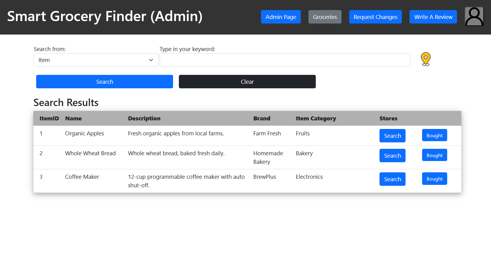

# Smart Grocery Finder
User input-driven web application aimed to make finding and comparing groceries around your area more convenient.\
Written in PHP and JavaScript.\
Originally deployed on Google Cloud Platform.

Running the website locally on XAMPP:

1. Download XAMPP
2. Clone this repo under XAMPP/htdocs
3. Make sure Apache and MySQL in XAMPP Control Panel is running
4. Change connect-db.php accordingly to your local database setup (http://localhost/phpmyadmin/)
5. Go to "http://localhost/smart_grocery_finder/login.php"

